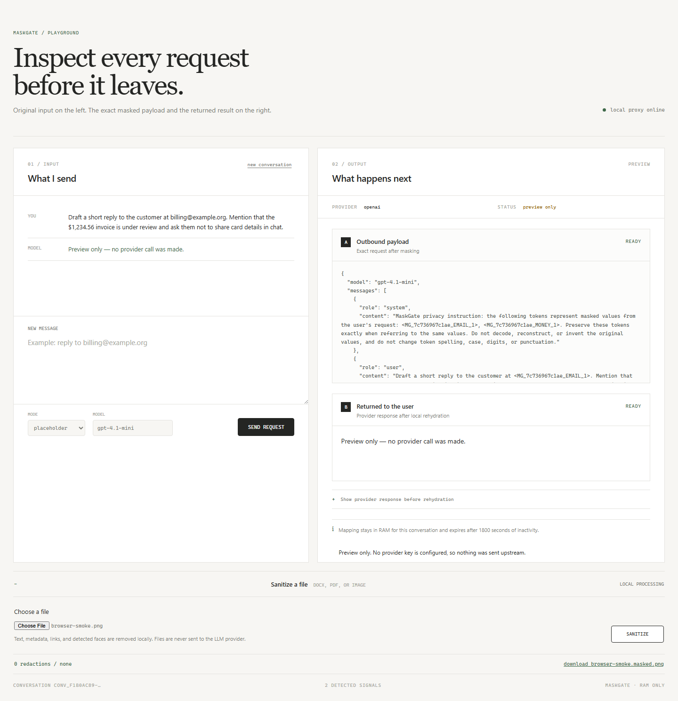

# MaskGate

[](https://github.com/Morow-bwa/maskgate/actions/workflows/ci.yml)
[](https://github.com/Morow-bwa/maskgate/actions/workflows/codeql.yml)

Self-hosted privacy proxy for remote LLM APIs. MaskGate detects supported sensitive values locally,
applies contextual policy, sends only a post-Adapter checked body, and restores authorized tokens
in the response.

This is an educational open-source project and technical showcase. It is not a certified DLP or
compliance product, and it does not claim complete PII detection.



```text
client -> principal -> detection -> risk/policy -> RAM vault -> canonical IR
                                                               |
remote provider <- exact checked bytes <- provider Adapter <---+
       |
client <- authorized restore <- output privacy guard <----------+
```

## Implemented

- OpenAI-compatible `POST /v1/chat/completions`, including strict buffered streaming.
- Runtime provider paths for OpenAI-compatible Chat and Gemini `generateContent`.
- Canonical Privacy IR plus tested library Adapters for OpenAI Responses, Anthropic Messages, and
  experimental Gemini Interactions.
- Bounded Unicode canonicalization, pluggable recognizers, checksum validators, strict detector
  profiles, deterministic privacy risk, and contextual Policy v2.
- Random opaque tokens, bijective bounded RAM vault, conversation mapping pruning, and
  credential-derived principal isolation.
- Recursive transformation of messages, object keys, metadata, tool definitions/arguments/results,
  and structured text fields.
- Final post-Adapter wire guard; built-in transports send the exact checked bytes.
- Output inspection before restoration, new-PII redaction, safe structured conversation history,
  and malformed response/stream rejection.
- Local DOCX, PDF, PNG, JPEG, WebP, TIFF, and BMP anonymization with fail-closed format/resource
  checks.
- Bearer auth, rate/body/response limits, trusted hosts, safe logs/metrics, production hardening,
  dependency/secret scans, CodeQL, and container CI.

See [Privacy guarantees](docs/PRIVACY_GUARANTEES.md) for the exact boundary and limitations.

## Quick start

### Windows

Requires Python 3.12 and Node.js 22 with Corepack or pnpm:

```powershell
& .\run-playground.ps1
```

Open [http://127.0.0.1:8080/playground](http://127.0.0.1:8080/playground). Without a provider key,
the Playground shows the exact sanitized preview and makes no external request.

### Docker

```bash
docker compose up --build
```

The local profile binds to `127.0.0.1`.

## Remote provider

Create an untracked `.env`; the browser never receives the provider credential:

```env
LLM_PROVIDER=openai
LLM_BASE_URL=https://api.example.com/v1
LLM_API_KEY=replace-with-provider-key
LLM_DEFAULT_MODEL=provider-model
DETECTOR_PROFILE=strict
```

`LLM_PROVIDER=gemini` selects the built-in Gemini Adapter. Other Adapters are library-level until
their complete runtime path is documented in [Providers](PROVIDERS.md).

```bash
curl http://127.0.0.1:8080/v1/chat/completions \
  -H "Content-Type: application/json" \
  -d '{"model":"provider-model","messages":[{"role":"user","content":"Email billing@example.org"}]}'
```

## Policy and public data

Set `POLICY_V2_FILE` to a strict contextual YAML policy. A public contact or famous name requires an
exact hashed assertion scoped to tenant, application, provider, direction, and purpose, with expiry
and provenance. It is not globally allowlisted. See [Policy](POLICY.md) and the
[example schema](docs/policy-schema-v2.example.yaml).

## File anonymization

Files are processed locally and never attached to a provider request automatically:

```bash
curl -F "file=@document.pdf" \
  -o document.masked.pdf \
  http://127.0.0.1:8080/v1/privacy/files/anonymize
```

OCR and face detection can miss content. Review sanitized files before high-risk use. Secure PDF
mode rasterizes pages and loses search, links, forms, and accessibility structure.

## Production

Production requires inbound auth, trusted hosts, HTTPS provider configuration, and disabled
Playground/debug routes:

```bash
cp production.env.example production.env
docker compose --env-file production.env -f compose.production.yml up -d --build
```

Terminate TLS at a reverse proxy and use one application worker: conversation mappings are
process-local RAM. See [Deployment](docs/DEPLOYMENT.md), [Threat model](docs/THREAT_MODEL.md), and
[Vault](VAULT.md).

## Verification

```powershell
python -m ruff check app evaluation scripts
python -m pytest app/tests --cov=app --cov-branch --cov-report=term-missing
python -m evaluation.evaluate_detection --profile strict
python -m pip_audit --local
python scripts/check_secrets.py --history
pnpm --dir playground-react build
pnpm --dir playground-react audit --audit-level high
```

CI also runs Chromium smoke, Docker build, secret scanning, and CodeQL. Tests include assertions
against exact serialized request bytes observed by mock HTTP providers.

## Documentation

- [Architecture](ARCHITECTURE.md)
- [Detection](DETECTION.md)
- [Policy](POLICY.md)
- [Providers](PROVIDERS.md)
- [Vault](VAULT.md)
- [Migration](MIGRATION.md)
- [Security review](SECURITY_AUDIT.md)
- [Performance](docs/PERFORMANCE.md)

Apache-2.0. See [LICENSE](LICENSE).
