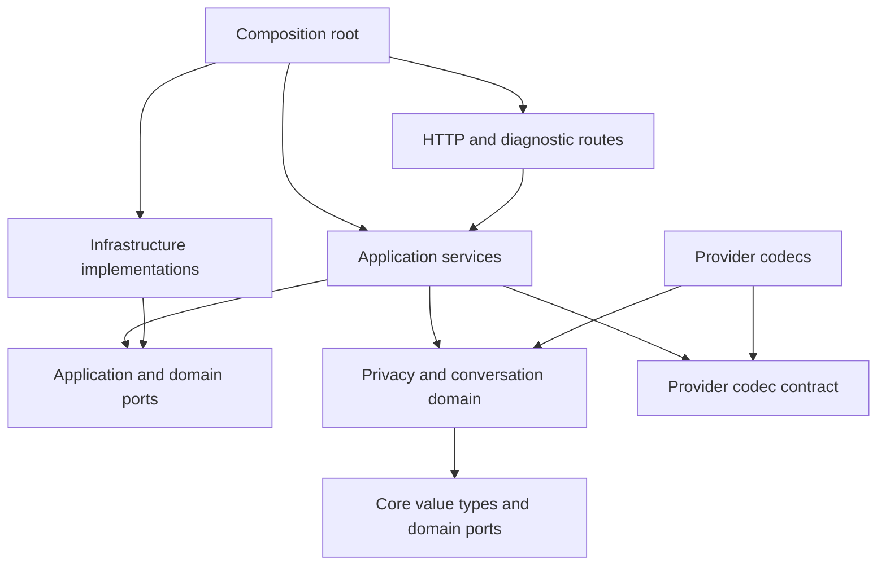

# MaskGate architecture blueprint

Date: 2026-09-08. Status: selected target design; implementation is pending.

This is an architecture handoff, not a runtime change or a release approval. Read it together
with [decision records](ADRS.md) and [coding-agent contracts](CODING_AGENT_CONTRACTS.md).
Existing accepted ADRs in `docs/adr/0001` through `0010` remain in effect unless explicitly
superseded by a later accepted decision. The records in this package extend them.

## 1. Executive architecture summary

**Decision: evolve the existing modular monolith, retaining one application process and a
bounded, RAM-only vault.** Preserve the final checked-byte transport boundary. Consolidate
conversation lifecycle and output finalization before extracting further modules or providers.

Threat model: clients, documents and providers are untrusted. The process, operator configuration,
local dependencies and controlled TLS/egress infrastructure form the trusted computing base.
Protect detected sensitive content, mapping ownership, policy integrity and bounded availability.
Heuristic detection does not establish complete anonymity or prevent arbitrary covert channels.

Acceptance criteria for the target:

1. A built-in transport sends exactly the body inspected after provider serialization.
2. Detector errors, unsupported structures and exhausted inspection budgets never become permission.
3. History accepts only a sanitized, provider-safe representation; client restoration is separate.
4. One principal/conversation generation has one active writer. Expiry, deletion, cancellation and
   commit obey the same lifecycle contract, including streaming requests.
5. Restoration requires a currently valid scope permit, not merely possession of a mapping list.
6. Global, principal and operation budgets bound retained state and concurrent work together.
7. Policy context and approval scope survive transformations and provider translation.
8. The documented runtime provider matrix remains unchanged until separate compatibility gates pass.

The first implementation priorities are streaming history, exception-safe state ownership,
expiry/deletion races, and aggregate resource admission. A rewrite, database, broker or distributed
vault is not needed to fix these issues.

## 2. Current architecture analysis

### 2.1 Evidence and inspected baseline

Inspected branch: `codex/phase2-privacy-consistency`.
HEAD: `102dcc29970c41257832ccf8f38ff0060d21a54d`.
The inspected baseline includes pre-existing uncommitted runtime, test, documentation and harness
changes. HEAD alone does not identify the analyzed behavior. In particular, the shared decoder
and September 6 terminal regressions are present locally. Historical encoded-key and decoder-budget
findings must not be described as still unfixed in this working tree.

Read the repository's agent instructions, architecture, provider matrix, source/test manifest,
configuration, HTTP composition, Chat/Responses flows, guards, adapters/transports, state stores,
policy/detector contracts, media path, observability, frontend and deployment/CI definitions.
Line references below describe this working-tree snapshot and may move during implementation.

Executed in this review:

| Verification | Current result |
|---|---|
| `scripts/check.ps1 -Command context` | PASS; module and support map paths exist |
| `scripts/check.ps1` | PASS; 404 tests, 83.69% branch-aware coverage |
| Strict detection corpus in full harness | 598 cases; zero false positives/negatives on this corpus |
| Ruff and repository credential-pattern scan | PASS, as stages of the full harness |
| In-memory lifecycle probes | Locked-state expiry and silent stale-commit loss reproduced |
| Local TestClient streaming probe | Raw new provider PII retained in history; subsequent turn blocked |
| Injected transform-failure probe | Streaming conversation lock remains held; zero upstream calls |

Harness receipt: `output/harness/24d961baa20f484a9dfc22c205214fe5/report.json` (ignored local artifact).
The tests used the bundled Python 3.12.13 with existing venv packages because the normal Python
launcher was unavailable. No packages were installed. Docker, live providers, new remote CI,
dependency audits, frontend build and browser smoke were not executed in this architecture review.
Earlier reports of those checks are historical evidence, not new results. No independent agent
audit or exhaustive penetration test was performed.

Diagnostic probes were run from stdin, with synthetic values and mock upstreams. They printed
only statuses, counts and booleans. They did not modify runtime files or add production code.

### 2.2 Product, stack and deployment

MaskGate is a self-hosted educational privacy proxy and technical showcase. It locally transforms
supported sensitive text, sends a provider-specific checked request, inspects provider output,
and restores approved tokens to the requesting client. Local file anonymization and a diagnostic
Playground are adjacent capabilities; sanitized files are not automatically sent to an LLM.

| Area | Observed implementation |
|---|---|
| Runtime | Python package requires >=3.11; documented/container runtime is Python 3.12 |
| HTTP | FastAPI, Pydantic v2, Uvicorn; httpx async outbound calls |
| Privacy | Local detector ensemble, canonicalization, deterministic risk, contextual Policy v2, legacy compatibility adapters |
| Data model | Dataclass-based privacy types and canonical IR; JSON dictionaries at several application seams |
| Sensitive state | `InMemoryVault`, `MaskingSession`, request mapping index, conversation store; no database |
| Frontend | React 18, Vite, JavaScript, pnpm; component memory for messages/results, no localStorage use found in the entry file |
| Media | defusedxml/ZIP inspection; optional Pillow, PDFium, OpenCV, ONNX Runtime and RapidOCR |
| Configuration | Environment/dotenv and local YAML; settings assembled at app creation |
| Packaging | Python requirements lock and pnpm lock; multi-stage Node/Python Docker image |
| Operations | Single Uvicorn worker, non-root container, read-only filesystem, tmpfs, capability drop, CPU/memory limits |
| Validation | pytest/coverage, Ruff, synthetic corpus, exact MockTransport tests, browser smoke script, CI audit/build/CodeQL jobs |

The repository's existing directories are substantive modules, not an empty scaffold:
`app/chat`, `responses`, `identity`, `privacy/{detection,risk,policy,ir}`, `providers`, `proxy`,
`masking`, `storage`, `media`, `observability`, and `playground-react`.

### 2.3 Current runtime and data flow

`app/main.py:create_app` is the composition root and also defines middleware, health and
Playground configuration handlers. It instantiates one detector ensemble, a legacy detector view,
both legacy and v2 policies, stores, guards, clients and orchestrators.

Chat transforms the source-shaped JSON before parsing it into canonical IR and serializing to
the destination provider. Responses parses to IR first and performs its own traversal. Chat has
separate request, conversation and streaming paths. Responses manually assembles its checked
request and does not use the Chat-oriented `PrivacyPipeline.complete` validator.

Provider adapters are mostly pure schema translators. Network clients still contain response
conversion and compatibility request conversion. The final guard canonicalizes JSON, reparses its
immutable bytes, inspects them and issues `PrivacyCheckedPayload`. Built-in clients use `content=`.

The authenticated credential defines a pseudonymous principal namespace. The same conversation
ID under different credentials refers to distinct states. This is credential isolation, not a
full organizational IAM system. A shared key intentionally shares the same identity; key rotation
changes that identity. Local unauthenticated identity derives from the client host.

Conversation state contains a session/vault, masked messages and an asyncio lock. Turns clone
the session and commit it with retained history on success. A separate thread lock protects store
indexes. Request mapping entries are normally deleted in `finally`; periodic TTL sweeping is a
fallback. There is no durable transaction, durable job, event broker or replay log.

Runtime support observed in routes, composition and `PROVIDERS.md`:

| Ingress | Destination | Supported behavior |
|---|---|---|
| `/v1/chat/completions` | OpenAI-compatible Chat | Non-stream and strict buffered streaming |
| `/v1/chat/completions` | Gemini `generateContent` | Non-stream and converted streaming |
| `/v1/responses` | OpenAI Responses | Reviewed non-stream subset, forced `store: false` |
| Adapter libraries | Anthropic Messages / Gemini Interactions | Not complete public network routes |

Responses streaming, remote/built-in provider tools and server-side conversation chaining are
rejected. An adapter's existence does not authorize enabling its provider in production.

### 2.4 Ranked architectural findings

Severity measures impact on documented privacy, state correctness and availability. **No new
CRITICAL issue was established by this bounded review.** This is not a claim that none exist.
HIGH means a demonstrated invariant failure or a significant control gap with a concrete trigger.
MEDIUM means operational/reliability or extension risk; LOW means limited maintenance friction.

| ID / severity | Evidence and concrete consequence | Architectural response |
|---|---|---|
| H1 HIGH, reproduced | `app/chat/orchestrator.py:702` reads `provider_text()` and commits it at `:713`; `app/proxy/streaming.py:110` returns the raw accumulated field. A synthetic email generated by the provider was redacted in the client stream but retained in history. The next turn returned 400 `wire_privacy_violation`. The final guard prevented outbound leakage in this probe. | One output finalizer produces two explicit projections: provider-safe history and authorized client output. History cannot accept raw strings from a stream accumulator. |
| H2 HIGH, reproduced | `app/storage/conversation_store.py:65` cleanup ignores active locks; `commit` at `:98` silently returns if state identity changed. Fake-clock cleanup removed a locked state, allowed a second state under the same key and discarded the old commit. Delete has the same detached-reference design. | Lease/generation ownership, explicit stale/revoked results, revocation checks at restoration and commit. |
| H3 HIGH, fault reproduced | `app/chat/orchestrator.py:571` acquires a lock before streaming setup; cleanup is split among selected exception branches and the later generator `finally` at `:719`. Injected `ValueError` from transformation escaped and left the lock held, with zero provider calls. This is a fault-injection result, not a demonstrated normal-input exploit. | One cancellation-safe operation owner encloses setup, iteration and teardown. No hand-written release per error branch. |
| H4 HIGH, capacity risk | Defaults permit 1,000 conversations and 2 MiB sensitive originals per conversation (`app/config.py:83-86`), before indexes, messages, copies and in-flight output. Those configured allowances alone total about 1.95 GiB, close to the Compose 2 GiB process/container envelope. Request mapping index has no independent count/byte cap. Rate limits do not bound concurrent work. No saturation/OOM test was run. | Aggregate reservations, per-principal quotas and bounded admission before expensive allocation; include clone and stream costs. |
| H5 HIGH, control gap | `app/main.py:96-109` wires media to the legacy policy; `app/media/routes.py:21-28` does not pass principal/purpose into sanitization; `TextRedactor` calls legacy `action_for_entity`. A v2 tenant/path decision on Chat cannot be assumed to protect a file. | Same decision contract with a media-specific context and irreversible renderer; no remote-provider claim for local files. |
| H6 HIGH, deployment-dependent retention gap | UploadFile uses the installed Starlette parser's `SpooledTemporaryFile`, threshold 1 MiB (`.venv/Lib/site-packages/starlette/formparsers.py:147,230`). The accepted upload bound is larger. Container `/tmp` is tmpfs, but an ordinary Windows temp directory is not established as RAM-only. | Explicit upload storage boundary; bounded RAM ingestion or enforced private volatile temp storage. Do not describe all raw-upload handling on every deployment as RAM-only. No real private upload was tested. |
| M1 MEDIUM, provenance gap | `PrivacyTransformResult.approved_originals` becomes a value-only set in `PrivacyPipeline.prepare` and Responses. The wire guard receives no grant path, expiry or decision identity. Paths also differ between Chat source JSON and Responses IR. | Scoped approval evidence and source-to-wire provenance. This is a defense-in-depth gap, not a reproduced public-route bypass. |
| M2 MEDIUM, stream model gap | `BufferedStreamingOutputGuard._text_paths` keys buffers by array position, not declared choice/tool indexes. `provider_text()` exposes only the first text path; Chat stream history omits structured assistant tool/refusal state. | Semantic stream identifiers and one typed completed-response model; validate order/termination. No interleaving exploit was executed here. |
| M3 MEDIUM, policy contract gap | Loader accepts obligation strings; runtime records actions but has no obligation dispatcher. Examples include `audit_decision` and `alert_security_owner`. Returned metadata is not enforced execution. | Distinguish annotations from enforceable obligations; reject unsupported mandatory obligations at configuration load. |
| M4 MEDIUM, time/resource coupling | Chat privacy work is synchronous inside async handlers; both clients create a new AsyncClient for each operation. httpx timeouts are phase/inactivity bounds, not one end-to-end deadline. Lock wait and slow upstream streams can outlive expected budgets. | Absolute operation deadline, bounded local work and reusable provider transport lifecycle with explicit connection limits. |
| M5 MEDIUM, dependency direction | Responses imports `error_payload` from Chat; privacy runtime depends on concrete legacy masking/metrics; storage imports `MaskingSession`; Chat embeds FastAPI responses, tracing, history, transformation and streaming lifecycle. | Shared contracts and small application services; preserve format-specific coordinators instead of introducing a universal mega-orchestrator. |
| M6 MEDIUM, observability gap | Enumerated wire/output/vault metrics exist but source search finds runtime emission mainly for ingress detection/risk/policy/tokenization. Snapshot contains count/total/max, not percentiles. Readiness checks provider configuration, not connectivity or resource state. | Actual stage instrumentation, histograms, bounded protected exporter, explicit readiness semantics. |
| L1 LOW, documentation drift | `docs/policy-schema-v2.example.yaml:3-6` says assertions precede rules; current engine gives matching block/review precedence. A dead Chat branch still calls streaming unsupported in the MVP. | Update behavior docs alongside focused changes; no cosmetic mass rewrite. |
| L2 LOW, environment friction | Local venv launcher is broken, wrapper uses a machine-specific fallback. Packaging allows >=3.11 while standard CI/container is 3.12. | Publish the tested runtime matrix and reproducible environment instructions; do not repair environments as a side effect of architecture work. |

The existing exact-byte guard, detector capability checks, principal scoping, bounded decoding,
strict provider subsets and safe log formatter are assets to preserve. Splitting them into services
would not resolve these findings automatically.

## 3. Target architecture and alternatives

### 3.1 Options

All options must preserve privacy semantics. Ratings are qualitative design judgments for the
observed self-hosted product, not measured benchmarks or cost estimates.

| Dimension | A. Modular monolith, local RAM | B. Service-oriented gateway + privacy/vault + provider services | C. Hybrid: synchronous text core + asynchronous media workers |
|---|---|---|---|
| Complexity | Low/medium; leases and typed seams are necessary | High; RPC, identity propagation, distributed state | Medium/high; job lifecycle, secure artifact handoff |
| Maintainability | Best fit for current repository/team | Independent services, more contracts and coordinated changes | Good only if media evolves independently |
| Scalability | Vertical, bounded; one state owner | Potential horizontal scale after a new vault design | Independent media capacity; text remains bounded |
| Reliability | One failure domain; no internal network dependency | More partial failures; isolation requires engineering | Media crash isolation; broker/worker failures added |
| Latency | Lowest local call overhead | Serialization and network hops at sensitive boundaries | Text unchanged; media queue delay |
| Operational burden | One image/process plus TLS/egress controls | Certificates, service auth, discovery, telemetry, key management | Core plus worker supervision, queue and expiry handling |
| Development velocity | Fastest incremental path | Slowest initially | Useful only with enough media demand |
| Cost | Lowest baseline resource/operations cost | Highest baseline and operating effort | Intermediate; idle workers/broker can dominate small installs |
| Testability | Deterministic in-process and exact-wire tests | Requires RPC/partition/identity and distributed fault tests | Requires duplicate-job/cancel/result-expiry tests |
| Security | Small network surface, sensitive data local to process | More trust crossings; encrypted vault and service identity mandatory | Raw documents cross an additional execution boundary |
| Migration | Focused extractions and behavior fixes | Major redesign; conflicts with current deployment invariant | Moderate/large; new asynchronous public contract |

### 3.2 Decision, rationale and trade-offs

Select A. The highest risks concern ownership inside one process, not a lack of service
decomposition. Sensitive mappings benefit from remaining local. Existing modules and tests provide
seams for incremental change. Neither a database nor a broker is required by current behavior.

Reject B for this scope because network isolation would require a new authenticated, encrypted,
tenant-separated vault protocol and distributed deletion/expiry semantics. Reject C as the default
because the current file endpoint is synchronous and there is no measured workload that justifies
durable jobs or remote workers. C is a credible later option for media failure isolation.

We consciously accept restart loss, one process as an availability domain, no transparent
horizontal scaling of conversations, strict streaming's completion-like time to first safe text,
and synchronous bounded media latency. Provider failures still affect user requests.

### 3.3 Reconsideration triggers

Reopen an ADR when any of these is established, rather than pre-building infrastructure:

- Agreed availability requirements demand surviving a process/host loss with conversation continuity.
- Representative load still exceeds the accepted latency/capacity envelope after admission,
  connection reuse and profiling; a larger single instance is unacceptable.
- Native media parsing repeatedly crashes the process or misses a required hard cancellation bound:
  first evaluate a supervised local subprocess, then option C if asynchronous jobs are required.
- Multiple independently authenticated organizational subjects must share one tenant safely.
- Durable background work, recoverable jobs or an externally required audit receipt becomes a
  product requirement. Each requires a retention and encryption design before storage is selected.

## 4. Architecture diagrams

Arrows in this first diagram mean runtime data flow, not source imports.

```mermaid
flowchart LR
    Client[Untrusted client] --> HTTP[HTTP validation and principal]
    HTTP --> App[Chat / Responses application services]
    App <--> State[Conversation leases and bounded RAM vault]
    App --> Policy[Detection, risk, policy, transformation]
    Policy --> SafeIR[Provider-safe canonical request]
    SafeIR --> Adapter[Provider serializer and provenance]
    Adapter --> Wire[Final wire guard]
    Wire --> Checked[Immutable checked bytes]
    Checked --> Transport[Bounded provider transport]
    Transport --> Provider[Untrusted remote provider]
    Provider --> Decode[Bounded JSON / SSE decoding]
    Decode --> Finalize[Typed output validation and privacy finalizer]
    Finalize --> History[Provider-safe history]
    History --> State
    Finalize --> Restore[Restore with live scope permit]
    Restore --> Client
    HTTP --> Media[Local bounded file sanitization]
    Media --> Client
```



Media calls the same detection/policy interfaces with a local-media context, but does not call
the provider transport. The graph omits metrics arrows intentionally: only safe enumerated
metadata may enter telemetry.

## 5. Module boundaries

Module names below are logical ownership boundaries. Proposed interfaces are design contracts,
not claims that these APIs already exist. Physical migration is incremental (sections 14 and 16).

| Module | Responsibility; inputs -> outputs | Owned state | Public interface | Allowed dependencies | Forbidden dependencies | Failure behavior |
|---|---|---|---|---|---|---|
| HTTP boundary | Parse supported request DTOs, authenticate, map application results -> HTTP/SSE | Request connection and trusted principal attachment | Route handlers, safe error presenter | Application facade, auth resolver, DTOs | Concrete vault, policy decisions, provider SDK calls | Reject malformed/unauthorized requests before work; never echo raw validation input |
| Identity | Verified credential -> pseudonymous principal | Immutable resolver configuration | `resolve_verified_identity` | Identity types, configured credential registry | Request-body tenant claims, provider credentials, vault mutation | Unknown credentials deny; local mode explicit |
| Application execution | Coordinate format-specific use case, deadline, admission and finalization | Active operation lifecycle | `execute_chat`, `execute_responses`, `stream_chat`, `sanitize_file` | Domain contracts and injected ports | Direct sockets, private store indexes, FastAPI response construction | Abort staged state and release resources on all failures/cancellation |
| Detection and risk | Bounded text/views + context -> findings and deterministic assessment | Immutable profile/recognizer configuration | Existing `PrivacyDetector`, capability check, risk assessment | Privacy value types, local recognizers | HTTP, vault writes, YAML/env reads, remote inference | Uncertainty or capability mismatch denies/blocks startup |
| Policy | Findings + trusted context + snapshot -> decisions and scoped approval evidence | Immutable policy snapshot | `decide`, `validate_obligations` | Privacy/identity types and injected clock | Transport, history mutation, logging arbitrary reasons | Unknown required obligations/config reject; request review is a denial until supported |
| Transformation and vault domain | Decisions + source fields + scope -> transformed content and mapping reservations | Bijection and per-scope mapping rules | `transform`, `issue_replacement`, `prune` | Privacy value types, vault port, local replacement generator | Provider schemas, web framework, persistence selection | Collision/capacity/unsupported action denies; no partial publish |
| Conversation lifecycle | Own aggregate generation, lease, snapshot, commit, revoke and expiry | Index, quotas, active lease bookkeeping, safe messages and vault aggregate | `begin_turn`, `commit`, `abort`, `revoke`, `expire` | Conversation/domain types, RAM store and clock ports | HTTP/provider payloads, direct restoration, detached raw mapping exports | Explicit stale/revoked/capacity outcomes; no silent successful commit |
| Provider codecs | Supported provider envelope <-> canonical request/response/events | Immutable capability registry and schema rules | `parse_request`, `serialize`, `decode_response`, `decode_event` | Canonical IR and bounded JSON primitives | Vault, policy decisions, credentials, network calls | Unknown fields/types or lost provenance reject |
| Final wire guard | Serialized candidate + scoped authorizations -> checked immutable bytes | No cross-request mutable state | `check_and_seal` | Detector, bounded decoder, protocol grammar, grant verifier | Network, policy relaxation, raw credentials, store access | Reject before send; never return a partly checked body |
| Output finalizer | Typed complete provider response + active scope -> safe history and client projection | Bounded operation-local accumulator | `accumulate`, `finalize`, `restore_for_client` | Detector/decoder, output schema, restoration permit | History store writes, network, ingress mutation | Redact inspectable unsafe content; reject malformed envelope or unsupported completion |
| Infrastructure | RAM storage mechanics, httpx lifecycle, clock/random adapters, bounded file/OCR execution | Clients, pools, internal storage data structures, native adapters | Implement application/domain ports | Their port contracts and third-party libraries | Choosing privacy policy, sending unsealed bodies, global response cookies | Typed transport/resource failures; deterministic close/drain |
| Observability | Safe events/counts/histograms -> bounded snapshots/export | Bounded counters/histograms/export buffer | Typed `record`, `observe`, `health_snapshot` | Enumerated contracts, optional sink adapter | Prompts, payloads, mappings, model strings, raw provider IDs, arbitrary labels | Telemetry may drop; never weakens privacy. Explicit mandatory audit obligations are separate |

Ownership clarification: the lifecycle module owns a conversation aggregate; its RAM adapter owns
storage mechanics. The vault domain owns bijection rules within that aggregate. Neither storage
nor output finalization decides whether a turn should commit. Output finalization returns a value;
application execution requests commit through the lifecycle interface.

## 6. Dependency rules

Arrows below mean source dependencies. Infrastructure implements inward-owned ports.



Enforce these rules with import/AST tests rather than relying on directory names:

- Domain MUST NOT import FastAPI, httpx, concrete stores, environment configuration or application.
- Codecs MUST NOT import transport clients, credential configuration, storage or masking sessions.
- HTTP routes MUST NOT issue tokens, select policy actions or call httpx.
- Chat and Responses MUST NOT import each other's orchestrators or error helpers.
- Production transports MUST require `PrivacyCheckedPayload`; dictionary compatibility belongs in
  a separately named, explicitly guarded library entry point, never the injected runtime port.
- Only the composition root selects implementations. No `getattr`-based capability inference in
  security-sensitive dispatch; configured capability descriptors are validated at startup.
- History storage MUST accept only `ProviderSafeHistory`, never `ClientResponse` or raw output.
- The decoder MUST NOT restore values or write state. Restoration MUST NOT call a provider.
- Media MUST NOT upload content, download execution-time models or write originals to ordinary
  persistent temp storage under the strict deployment contract.
- The current `docs/agent/project.json` remains a navigation manifest. Add executable dependency
  checks alongside it; do not mistake its path existence check for architecture enforcement.

## 7. Data architecture

### 7.1 Entities, aggregates and state ownership

| Entity/value | Key and owner | Sensitivity and lifetime |
|---|---|---|
| PrincipalContext | Trusted credential-derived identity; identity module | Pseudonymous but linkable; per request/configuration lifetime |
| PolicySnapshot | Version + content revision; policy module | Trusted local configuration; hashes/provenance still require access control |
| RequestPrivacyContext | Server-generated operation ID; execution module | Principal, purpose, route, detector/policy revisions, deadline; RAM only |
| ConversationAggregate | Principal namespace + conversation ID + generation; lifecycle module | Safe history plus sensitive vault, mode, revision, idle expiry |
| MappingEntry | Scope/generation + opaque replacement; vault domain | Original is highly sensitive; only active referenced entries retained |
| TurnLease | Aggregate identity + revision + bounded deadline | Non-serializable local capability; active operation only |
| ScopedApproval | Decision reference, exact permitted occurrence, provider/direction/purpose, expiry | RAM-only evidence; no global raw-value allowlist or logged value hash |
| CanonicalRequest | Parsed request; execution owns mutable lifetime | May contain originals before transformation; canonical does not mean safe |
| ProviderSafeRequest | Transformed detached IR + scope/provenance | May retain equality tokens and explicitly approved public values; still confidential |
| PrivacyCheckedPayload | Provider, configured destination identity, target, immutable bytes | Provider-bound content; never cached/logged merely because it passed checks |
| ProviderSafeHistory | Sanitized typed turns, opaque tokens, approval provenance when necessary | Confidential local RAM state; never restored originals |
| ClientProjection | Final authorized result | May contain originals; no-store, no cache, no history insertion |
| MediaOperation | Principal + operation ID; bounded local execution | Raw and sanitized bytes local/volatile; destroyed at request completion |

Frozen dataclasses containing nested dictionaries are not deeply immutable. Safe envelopes must
detach input and prevent later mutation, or expose reparsed/copy views as the current checked-byte
type does. Do not invent a cryptographic security boundary between trusted Python modules.

### 7.2 Transactions and consistency

Use one serialized turn per principal/conversation generation. `begin_turn` atomically obtains
a live lease and returns a private working snapshot. No global store lock is held during network
I/O. A turn commits its safe history, mapping references and revision together. Capacity is
reserved before additions/cloning, and adjusted atomically when pruning or aborting.

Commit is local and atomic; the provider call and client network delivery cannot join that
transaction. A successful provider call followed by a local failure may still incur provider
cost. Commit before reporting application success. A client disconnect after commit can leave
a committed turn without an observed response; the API must not promise exactly-once execution.

Operation state transitions are `ADMITTED -> LEASED -> PREPARED -> SENT -> VALIDATED -> COMMITTED
-> DELIVERING -> CLOSED`. Failure before commit goes to `ABORTED -> CLOSED`; failure after commit
records delivery failure and closes without rolling back a potentially observed turn. Request-only
Responses uses an operation scope instead of a conversation lease and has no retained-history commit.
Commit publishes state but does not close the operation's restoration permit. Keep the bounded
scope alive through delivery/teardown, and release the single-writer lease on close in the initial
implementation. Thus a slow client consumes admitted capacity only up to the operation deadline.
Do not add early writer release until snapshot and revocation semantics have separate evidence.

Idle TTL does not evict a live leased aggregate and create a second writer. An active turn instead
has a separate absolute deadline. Explicit deletion revokes the generation immediately, marks
active leases unusable, cancels their provider work where possible and prevents later restoration
or commit. Retain a bounded tombstone until active references drain; do not keep mapping originals
in tombstones. A new turn using the same external conversation ID gets a new generation.

At client output enqueue and commit, verify that the permit is still valid. Bytes already handed
to the socket cannot be recalled. This defines deletion's boundary honestly. Cleanup must not wait
for a long network call while holding the store mutex.

### 7.3 Persistence, retention and encryption

No database, shared cache, event log or message broker in the selected architecture. Durable
configuration and code are allowed; prompts, mappings and response bodies are not persisted.
Request-scoped originals expire at operation teardown; conversation originals live only while
referenced by an unexpired aggregate. Preserve current TTL defaults initially (request mapping
fallback 3,600 seconds; idle conversation 1,800 seconds), but normal cleanup is immediate.

Raw file upload spooling is a separate boundary from vault storage. Strict mode must use bounded
RAM upload buffers or an explicitly verified private volatile spool; plaintext OS temp files do
not satisfy a RAM-only claim. Container tmpfs reduces disk persistence but does not provide memory
zeroization or protection from privileged inspection/swap.

TLS protects inbound and outbound transit. In-process encryption is not presented as protection
from a compromised process. A future persistent/shared vault requires a new ADR for authenticated
encryption, tenant keys, associated scope data, rotation, expiry, replay and disaster recovery.
Do not add plaintext Redis as a shortcut. Policy value hashes are matching aids, not encryption.

### 7.4 Budgets, caching, events and idempotency

Admission accounts for raw body buffers, transformed copies, vault indexes, history, request
mapping references, decoded views, SSE accumulation and native media allocations. Bound all three
levels: global process, principal and operation. Token count and sensitive-original bytes alone
do not approximate total RSS. Start with conservative measured reservations and a process RSS
headroom threshold; publish the workload-specific supported envelope after load tests.

For a 2 GiB deployment, do not treat the present 1,000 x 2 MiB allowances as simultaneously
available. Derive retained-state allowance from `memory limit - measured baseline - peak admitted
operations - native media reserve - headroom`. Reject new work before that allowance is exhausted.

Cache immutable compiled policy/recognizer configuration and reuse network connection pools.
Do not cache prompts, detections keyed by raw values, checked bodies, restored answers or mappings
outside their owning aggregate. No durable queues. Internal telemetry events contain fixed codes
and aggregates only; their loss cannot corrupt a privacy transaction.

Generation POST requests have no exactly-once/idempotency guarantee. Default: no automatic
generation retries and no response-body replay cache. Duplicate POSTs may invoke the provider
twice. Delete is idempotent. If a client later requires idempotency keys, design a bounded,
principal-scoped receipt protocol separately; a header alone cannot eliminate ambiguous upstream
execution or recover state after restart.

Configuration migrations are explicit and versioned. RAM state is drained/discarded during a
restart; do not serialize it to make a code migration convenient.

## 8. Critical execution flows

### 8.1 Non-stream Chat, conversation turn

Request -> HTTP validation/authentication -> admission -> application -> live turn lease ->
source parsing and policy context -> detection/risk/decisions -> staged transformations/vault ->
safe IR and retained history -> provider serializer/provenance -> final wire guard -> checked
bytes -> bounded transport -> remote provider -> typed bounded response -> output finalizer ->
safe history plus client projection -> live-permit check -> atomic commit -> client response.

Failure before transport: abort reservations, release lease, return a safe error; zero network
calls. Provider/output failure: do not append a successful assistant/user turn, discard staged
mappings, close transport and release lease. A revoked generation cannot restore or commit.

Historical approved public data must not inherit an expired authorization: retain decision
provenance with safe history and revalidate on the next send, or block that history. Never convert
an earlier one-request ALLOW into a permanent conversation-wide exemption.

### 8.2 Strict streaming

Same ingress/lease/checked-byte path -> bounded SSE reader -> provider event decoder -> semantic
choice/tool accumulator -> complete validated fields/response -> output finalizer -> safe history
and authorized output -> commit -> safe completion frames and successful terminal marker.

Continue to buffer sensitive text/tool arguments; transport streaming does not imply immediate
client text. Key state by declared choice index and tool index/ID, not frame array position.
Preserve tool calls, tool IDs, refusal and finish state. Metadata frames sent early must be typed
and sanitized, and must not claim successful completion before privacy finalization.

If upstream termination is missing, fields conflict, budgets expire or the stream is cancelled:
close upstream, abort staged history and release the lease. Before HTTP headers, return an error
status. After headers, send only a safe error event if the socket permits and close without the
success marker. Do not replay a failed stream. No guarantee can retract previously emitted bytes.

### 8.3 OpenAI Responses

Request -> authenticated application -> request-scoped vault -> Responses schema parser ->
canonical transformation -> serializer forcing `store: false` -> wire guard -> checked transport ->
typed safe response projection -> output finalization/restoration -> response -> release scope.

Reject streaming, previous-response chaining, remote tools, unsupported media and unknown output
items. Sharing execution primitives must not accidentally route Responses through Chat validation.

### 8.4 Local file anonymization

Upload -> auth and bounded admission before buffering -> verified volatile storage -> local format
validation -> principal-aware detection/policy -> irreversible redaction/rendering -> structural
verification and output-size check -> file response -> cleanup.

Malformed ZIP/XML, expansion limits, missing OCR/format dependency or unsupported mandatory policy
obligation returns a bounded error. Never fall back to the original file. OCR/face detection remains
heuristic; a successful result is not a complete-anonymity certificate.

### 8.5 Deletion, expiry and process restart

Authorized delete -> lifecycle owner -> revoke generation -> prevent new use/restoration -> cancel
active work -> release originals when references drain -> discard tombstone. Repeated delete succeeds
without exposing another owner's existence. Idle expiry removes only unleased state; turn deadlines
bound leased state. Restart drops all RAM data; clients create a new conversation rather than
expecting restoration of old tokens.

## 9. API contracts

### 9.1 Public HTTP compatibility

Preserve the existing `/v1` routes and their documented subsets. This blueprint is not a claim of
full OpenAI API compatibility. Keep current headers/body fields for conversation ID and strip
MaskGate-only controls before transport. Conflicting body/header conversation IDs should become a
documented 422 rejection in the lifecycle phase, with a compatibility note; never silently retarget.

| Surface | Contract |
|---|---|
| `POST /v1/chat/completions` | Reviewed Chat request; non-stream response or strict buffered SSE. `model` and supported structure validated before acquiring state. |
| `POST /v1/responses` | Reviewed JSON request; stateless non-stream output projection; `store: false`. |
| `POST /v1/privacy/files/anonymize` | Bounded multipart file; local sanitized bytes or safe error. Context derives from trusted configuration and principal, not filename claims. |
| `DELETE /playground/api/conversations/{id}` | Existing local diagnostic deletion route, scoped to caller. No production admin surface is implied. |
| `/health/live`, `/health/ready` | Coarse health only; no secrets, prompt data or public tenant inventory. |

Use a stable safe error envelope: `error.type`, constant `error.message`, optional server-generated
request ID and bounded documented metadata. Strip validation input values, provider bodies,
arbitrary JSON paths, filenames and exception strings. New errors are additive unless the public
contract is intentionally revised. Existing differences such as `policy_block` versus
`privacy_policy_block` require a compatibility mapping, not an incidental rename.

Target status policy: 401 auth; 413 byte bounds; 422 invalid/unsupported request; 400 privacy
rejection (preserve current wire behavior); 409 revoked/stale/mode conflict; 429 principal quota;
503 global capacity/not configured/draining; 502 upstream or output-invalid errors. Preserve
existing timeout mapping initially; a switch to 504 is a separate documented contract change.
Do not copy an upstream error body or `Retry-After` without validating it.

### 9.2 Internal DTO and port contracts

These are interface specifications, not implementations or generated production code.

| Contract | Required input/output and invariants |
|---|---|
| `OperationContext` | Server request ID, verified principal, route/provider descriptor, policy and detector revision, purpose/jurisdiction, monotonic absolute deadline, budget lease. No raw credential. |
| `PrivacyDetector.analyze` | Text and DetectionContext -> findings; existing manifest semantics maintained at ingress/wire/output. Bounded work and explicit uncertainty. |
| `PolicyDecision` | Action, bounded decision reference, policy revision, typed obligations and optional scoped approval. Human reasons stay local and are not arbitrary log labels. |
| `TransformResult` | Detached safe content, staged mapping handle, exact occurrence provenance, decision evidence. No exportable list of originals for unrelated modules. |
| `SerializedCandidate` | Provider descriptor, configured destination identity, target, JSON candidate, mapping from serialized paths to canonical/source occurrences. Missing provenance denies exemptions. |
| `PrivacyCheckedPayload` | Existing immutable body property retained; target/provider binding is verified by the accepting transport. Body mutation requires a new check. Configuration owns auth headers. |
| `Transport.complete/stream` | Checked payload + deadline -> bounded raw provider envelope/events. No dictionary runtime overload, no request/body logs, no implicit retries or cross-origin redirects. |
| `ConversationService.begin_turn` | Principal, ID, expected mode, deadline -> lease and private snapshot, or capacity/revoked/conflict. Atomically reserve one writer. |
| `ConversationService.commit` | Live lease, expected revision, ProviderSafeHistory, staged vault -> committed revision or explicit stale/revoked failure. History and vault publish together. |
| `abort/revoke` | Idempotent teardown/revocation, no provider action after invalidation; release budgets exactly once. |
| `OutputFinalizer.finalize` | Validated complete output and scope -> ProviderSafeHistory plus pending client projection; sanitize before restore. Never writes storage. |
| `RestorationPermit` | Bound principal/scope/generation, approved output field categories, active token membership and validity deadline. Rechecked before enqueue. |
| `MediaSanitizer.sanitize` | Bounded local bytes + trusted MediaContext -> sanitized bytes and bounded counters; no reversible mapping or provider dependency. |

`ScopedApproval` must bind policy revision, entity/value match, exact occurrence or reviewed
semantic path, principal/application, provider, direction, purpose and expiry. A request-local
value fingerprint can be keyed; it is never logged or persisted. The policy module issues the
grant; the guard verifies applicability after translation without inventing a new policy decision.
If a serializer cannot preserve provenance for an exception, block rather than exempt the value
everywhere. Ordinary transformed tokens still use active scope membership.

### 9.3 Timeouts, retries and versioning

Keep provider phase timeouts but add a monotonic operation deadline covering admission, lock wait,
local privacy work, provider I/O and output finalization. Start from the configured upstream timeout
as an explicit compatibility input, then publish separate phase and total settings. CPU traversal
also needs node/depth/decoded-byte budgets and cooperative deadline checks; an asyncio timeout
alone cannot preempt synchronous code or stop a native OCR thread.

httpx distinguishes connect/read/write/pool timeouts; its read timeout bounds waiting for a chunk,
not total response duration. See [HTTPX timeout documentation](https://www.python-httpx.org/advanced/timeouts/).
Connection reuse follows an application-owned client lifecycle; it also requires preventing
cross-request cookie/header state from becoming an unreviewed outbound channel. See
[HTTPX client lifecycle and pooling](https://www.python-httpx.org/advanced/clients/).

No automatic generation POST retries, provider failover or stream replay. A later retry feature
must recheck deadline, scope and policy, and distinguish definitely-unsent failures from ambiguous
remote execution. Policy and adapter revisions are explicit; persisted policy syntax has a migration
path. In-process contracts are versioned by repository changes/tests, not by internal HTTP APIs.

## 10. Security model

Least privilege means network clients receive checked bytes and their own configured credential,
codecs receive typed content without credentials, telemetry receives only bounded metadata, and
media receives no provider transport. Raw originals are limited to active input, transformation,
owned vault and authorized client delivery. Provider-safe content remains confidential.

Authenticate once at the HTTP boundary. Treat principal resolution as identity derivation after
credential verification, not authentication by itself. Body-supplied tenant/application claims must
not override the trusted principal. Preserve exact caller scoping on conversation operations.
Organizational roles, admin APIs, shared tenant keys and SSO are separate product decisions.

Secrets remain in operator-controlled backend configuration or an injected secret source, never
the browser, IR, vault entries, URLs, traces or fixtures. Accept only configured destination
descriptors; validate final target and model-derived path grammar. Production TLS plus network
egress controls must restrict origins. Do not add arbitrary per-request provider base URLs.

Reject unknown schema fields except reviewed exact-path extensions; inspect keys and supported
decoded views. Preserve current 64 KiB UTF-8 per-string and four-decoding-layer limits, including
keys and completed streamed fields. Add aggregate decoded-work limits without relaxing those
limits. Protocol exceptions are exact-field bounded grammars, not exemptions for every key/ID.

Attack cases to retain: forged tokens, cross-principal conversation IDs, repeated/deleted scopes,
malicious provider text/tools, encoded keys/values, schema drift, numeric data under protocol names,
slow/infinite streams, reordered stream indexes, native parser bombs and abusive capacity use.

Production diagnostics remain disabled. The local Playground deliberately displays sensitive
request/response context to its owning user; that trace is a client diagnostic DTO, not an
observability event. Never send it to logs, metrics, tracing backends or error reporters.

Audit is a typed event describing decision/outcome/config revision, without values or low-entropy
value hashes. Initially there is no durable audit guarantee. A policy demanding an unavailable
mandatory audit/alert mechanism must fail configuration validation, not pretend delivery occurred.
Telemetry export is otherwise best effort and never changes a privacy decision.

## 11. Failure model

| Failure | Required behavior | State and recovery |
|---|---|---|
| Database unavailable | No database dependency in selected design | Not applicable; do not add fallback persistence |
| External API unavailable/rejects request | Safe upstream error; bounded deadline; no implicit retry | Abort staged turn; provider cost may be ambiguous |
| Request times out | Stop new work, cancel upstream, close stream; safe error if connection permits | Release lease and reservations; native media cancellation has a separate bounded execution limit |
| Queue unavailable | No required queue; optional telemetry export may drop | Privacy flow continues unless a specifically configured mandatory obligation cannot be met |
| Application process crashes | In-flight requests fail and all RAM state is lost | Restart creates new process state; old tokens cannot restore; no recovery fiction |
| Native media worker/thread hangs | Stop admission into saturated media capacity; fail health/deadline policy | A thread cannot be forcibly and safely stopped; hard isolation is a trigger for supervised subprocess design |
| Duplicate generation request | May execute again; no exactly-once claim | Serializes under conversation lease but may add another turn; client controls retry |
| Malformed input/unknown feature | 400/413/422 safe envelope before provider | No published state; release any early reservation |
| Detector/policy/serializer fails | Fail closed, safe internal error; no skip-to-provider fallback | Abort and release even for unexpected exceptions |
| Partial local operation fails | Staged mappings/history do not publish | Local atomic commit; never expose a successful turn on failed commit |
| Client disconnects | Cancel work where observable, no retry; no success marker on failed stream | Before commit abort; after commit state may exist although response was not observed |
| TTL during active request | Idle cleanup does not detach leased state | Absolute turn deadline bounds lifetime; one generation remains authoritative |
| Delete during provider call | Revoke permit, prevent further restoration/commit and cancel call | Already-sent remote data cannot be recalled; originals release when references drain |
| Global/principal capacity exhausted | Deterministic 503/429 before expensive work | Existing leases finish within deadlines; no blind eviction of active state |
| Shutdown/restart | Readiness false, stop admission, bounded drain, cancel remainder, close pools | Clear sensitive state; no disk checkpoint |
| Unknown provider output/invalid final SSE | Safe output error or redaction according to typed boundary | No raw fallback, no successful history append |

## 12. Observability model

Preserve the existing safe formatter and enumerated metric interfaces. Complete instrumentation
at wire rejection, output redaction, vault reservation/pruning, admission, stream finalization,
deadline/cancellation, stale commit and revocation. Record all public request paths consistently,
including Responses and media. Do not add arbitrary string labels to achieve this.

Logs: server-generated correlation ID, fixed route/provider category, fixed outcome/error code,
latency and bounded counts. No raw JSON paths, query strings, host/IP identities, filenames, model
IDs, prompts, provider bodies, token maps or raw exception arguments. Correlation IDs are not
authorization and are not metric labels.

Metrics: stage histograms, request outcomes, active leases/requests, reserved bytes, conversation
count, lock wait, buffer utilization, deadline/cancellation totals and cleanup lag. Export only a
bounded aggregate schema through an internal/authenticated endpoint or local collector. The current
count/total/max snapshot cannot supply a p95; add fixed buckets before publishing percentiles.

Traces: optional stage-only spans with sanitized fixed attributes, no body/headers or automatic
httpx URL instrumentation. Generate trace identity at the boundary; do not trust arbitrary client
trace baggage. A bounded loss-tolerant sink must not hold the turn lock.

Health: live means the process/event loop can respond. Ready means valid detector/policy composition,
configured runtime destination, initialized required local dependencies, not draining, and enough
admission headroom. It does not mean the provider recently accepted an LLM request. Avoid provider
generation in health checks; expose dependency degradation separately.

Candidate objectives, pending representative measurements:

- 99.9% local execution availability for valid in-budget requests over a defined month, measuring
  local failures separately from provider failures and intentional policy rejections. This is an
  aspiration, not a current SLA; one process may not satisfy an eventual continuity requirement.
- Zero unsafe sends/restores in the supported regression suite: an invariant gate, not a
  statistical guarantee of zero undetected PII in production.
- p95 local privacy overhead initially budgeted at 100 ms for a defined <=8 KiB synthetic text
  request without media; confirm or revise after profiling. Provider latency is reported separately.
- Every admitted operation terminates within its configured deadline plus a measured teardown
  allowance. No unbounded lock waiting; cleanup lag remains within the documented sweep interval.

Alert on sustained resource headroom exhaustion, stalled sweeper, rising output/schema failures,
unexpected lock age and cancellation cleanup failures. Any proven unsafe send is an immediate
release blocker. Alert thresholds must use measured baselines; user strings cannot become alerts.

## 13. Testing strategy

| Level | Required evidence |
|---|---|
| Unit | Policy precedence and obligation validation; detector semantics; bounded decoding; bijection; scoped approval matching; semantic stream accumulation; fake-clock lifecycle transitions |
| Integration | Application + RAM lifecycle + actual adapters/guards + mock transport; success/failure atomicity; delete/expiry/cancel barriers; resource reservation release |
| Contract | Exact `httpx.MockTransport` request content equals checked body; auth target/header isolation; zero HTTP calls on reject; DTO/status compatibility; provider response/event subsets |
| End-to-end | Local ASGI requests through auth/middleware/route; two-turn Chat including streamed tool calls and new provider PII; Responses tool round trip; local file download; credential-free browser smoke |
| Architecture | Import direction, prohibited httpx/FastAPI imports, only sealed runtime transport arguments, safe-history-only store API, no Chat/Responses sibling imports |
| Security | Encoded keys, budgets, all fragment split points, forged/cross-scope tokens, revoked lease, unknown schema, numeric path misuse, malicious provider error, parser bombs, safe logs/metrics and spool behavior |
| Load/fault | Slow chunks, absent termination, many choices/tools, concurrent owners, same-conversation waiters, aggregate memory admission, disconnects and injected exceptions |

Add compatibility fixtures beside every rejection fixture. Use barriers and injected clocks instead
of timing sleeps for races. Do not use real secrets or personal data, private files or live providers
to prove boundaries. The synthetic corpus tests the corpus, not real-world recall or compliance.

Run quick harness while implementing and full harness at each completed phase. For frontend changes,
also build and run `scripts/browser_smoke.py` against a credential-free local preview. For dependencies,
verify and audit both affected lock/deployment paths; do not confuse a host install with the Linux
production lock. Docker and remote/live compatibility remain separate gates.

## 14. Repository structure

Preserve working imports during early phases. This is the eventual ownership layout, not a request
to move every file at once or create empty frameworks. Each new directory appears with its first
real extraction and contract test.

```text
app/
  main.py                    # Stable ASGI entrypoint, minimal compatibility composition
  bootstrap.py               # Concrete wiring, settings validation, lifespan and resource shutdown
  api/                       # Shared safe HTTP errors, boundary DTOs and middleware helpers
  chat/routes.py             # Chat HTTP translation only
  responses/routes.py        # Responses HTTP translation only
  identity/                  # Principal types, resolver contract and local implementation
  application/
    contracts.py             # Use-case DTOs, budgets/deadline and outward ports
    chat.py                  # Chat-specific coordination
    responses.py             # Responses-specific coordination
    privacy_service.py       # Shared detection/policy/transformation use case
    conversations.py         # Lease, generation, revoke, commit lifecycle
    output.py                # Shared finalization orchestration and two projections
  privacy/
    models.py                # Privacy value types
    detection/               # One detector contract, recognizers and bounded canonicalization
    risk/                    # Deterministic risk assessment
    policy/                  # Pure decisions/obligations; configuration loading separated at boundary
    ir/                      # Typed canonical request, response and semantic stream values
    transformation/          # Policy-action rendering and replacement rules
    vault.py                 # Mapping/budget value types, bijection rules and vault contract
    wire.py                  # Last checked-byte boundary
    output_guard.py          # Pure provider-output sanitization and scoped restoration rules
    encoded.py               # Shared bounded encoded views and narrow protocol grammars
  providers/                 # Pure provider codecs and reviewed capability descriptors
  proxy/                     # httpx transports, bounded readers, no policy selection
  storage/                   # RAM implementations of inward-owned state/vault ports
  media/                     # Bounded local format/OCR adapters and irreversible renderers
  observability/             # Safe bounded metrics/log adapters
  masking/                   # Temporary compatibility exports, retired only after migrated callers
  policies/                  # Legacy compatibility and default configuration assets
  debug/                     # Local-only diagnostic routes
  tests/                     # Existing tests retained; new architecture/lifecycle tests nearby
playground-react/            # Diagnostic browser app, no provider credential ownership
evaluation/                 # Synthetic corpus and isolated performance fixtures
scripts/                    # Harness, environment helpers and release checks
docs/agent/                 # Source/test map and contributor execution workflow
docs/adr/                   # Accepted historical decisions
docs/architecture/          # This design and implementation handoff
```

Transport errors/DTOs move to the inward contract seam, not a generic `utils.py`. Policy YAML I/O
and concrete clock configuration belong at bootstrap/configuration boundaries; pure decisions
receive a validated snapshot. Existing top-level documentation continues to describe implemented
behavior until a migration phase actually changes it.

## 15. Architecture Decision Records

See [ADRS.md](ADRS.md) for Context, Decision, Alternatives and Consequences for each record:

- ADR-0011: Retain a modular monolith and local RAM deployment.
- ADR-0012: Own conversation state through leases and generations.
- ADR-0013: One output finalizer, separate history and client projections.
- ADR-0014: Preserve scoped authorization evidence through provider translation.
- ADR-0015: Bound aggregate resources and operation lifetime.
- ADR-0016: Separate policy compatibility from enforceable policy semantics.
- ADR-0017: Use explicit checked transport and codec contracts.
- ADR-0018: Keep telemetry content-free and optional; define mandatory audit separately.
- ADR-0019: Make raw upload storage an explicit deployment boundary.

## 16. Incremental migration roadmap

Every phase remains runnable. Feature exposure is not a migration technique. Keep existing tests,
compatibility imports and route subsets until their replacement is proven. Release blockers H1-H3
are fixed before broad package movement.

| Phase | Objective and changes | Dependencies | Main risks | Validation/exit criteria |
|---|---|---|---|---|
| 0: Establish baseline | Capture working-tree evidence; turn reproduced H1-H3 probes into synthetic regression tests; declare exact public compatibility behavior | None | Mistaking HEAD for dirty baseline; encoding old assumptions in tests | Existing full harness green; each new defect test fails for the expected reason; no live network |
| 1: Repair output and cleanup | Sanitize streaming history immediately; preserve tool/refusal history through typed finalization; enclose setup and generator lifecycle in one cancellation-safe owner | Phase 0 | Changing SSE ordering or losing client fields | New-provider-PII history case passes; second turn works; structured and sparse-index stream cases; no held lock/mapping after injected errors/disconnect |
| 2: Own state lifecycle | Introduce lease/generation port behind existing store facade; atomic commit result, expiry/deletion/revocation semantics; validate before acquire | Phase 1 cleanup baseline | Delete races, new implicit behavior for expired conversations | Fake-clock and barrier tests prove one writer; stale commit explicitly fails; delete prevents later restore; other principals unaffected |
| 3: Bound operations | Global/principal reservations, finite lock waits, absolute deadlines; reusable checked transport client with no cookie/header leakage; budget all copies/streams | Phase 2 | False capacity rejection, transport-state leakage | Slow-provider and saturation tests stay within configured budgets; all reservations drain; exact-wire/header tests pass |
| 4: Unify policy evidence | Shared request context and source/IR provenance; scoped approvals; typed supported obligations; principal-aware media policy and explicit volatile upload storage | Phases 2-3 | Existing policies/paths change meaning; platform-specific temp behavior | Policy migration fixtures preserve intended decisions; wrong/expired scope denied; media honors context; large upload never spills to ordinary disk in strict mode |
| 5: Extract stable modules | Move shared services/contracts and thin routes; remove Responses-to-Chat dependency; codec/transport split; architecture tests | Behavior contracts from prior phases | Broad movement hides privacy regressions | Same supported request/output fixtures; zero forbidden imports; full exact-wire/stream gates; runnable compatibility entrypoint |
| 6: Operational release gate | Wire missing metrics, readiness/drain, representative performance envelope; update agent map/provider/support/architecture docs; validate deployment | Prior phases | Reporting benchmark fixture performance as SLA | Full harness; applicable build/browser/lock audits; Linux Docker smoke and remote CI; publish tested limits and remaining live-provider uncertainty |

Rollback uses the previous code/configuration release after bounded drain; RAM sessions are lost.
Do not dual-run two active state owners or persist originals to ease rollback. Do not silently
fallback from a failed new privacy path to a weaker legacy path.

## 17. Coding-agent implementation rules

The executable handoff is [CODING_AGENT_CONTRACTS.md](CODING_AGENT_CONTRACTS.md): scoped tasks,
dependencies, allowed files, acceptance tests and stop conditions. Each task must report actual
validation and outstanding limits. Do not treat this design as authorization to commit, push,
deploy, enable a new provider, contact users or send private data to an external service.

Invariant changes, new data retention or new network trust boundaries require an explicit design
revision. Routine extraction within the specified boundaries does not require repeated permission.

## 18. Architecture risks

- Detection and OCR remain heuristic; strict transport enforcement cannot recognize all sensitive
  meaning or defeat arbitrary encodings/cross-field covert channels.
- Single-process state favors locality over continuity. A stronger uptime/durable-session requirement
  changes the architecture rather than merely increasing worker count.
- Lease/revocation and stream finalization are correctness-critical. New abstractions must simplify
  ownership, not create two parallel sources of truth during migration.
- Scoped approval provenance can become complex across adapters; deny unrepresentable cases rather
  than designing a generic policy language or weakening terminal checks.
- Native media dependencies remain in the trusted process and can exceed Python cancellation
  capabilities. Budgeting is not equivalent to crash isolation.
- Connection pooling adds ambient cookies/configuration state; exact body checking alone does not
  inspect every possible header channel. Transport tests must cover these additions.
- Memory estimates require measurement under actual concurrent workloads and native dependencies.
  Per-field limits and synthetic short benchmarks cannot establish a process capacity guarantee.
- A frozen IR wrapper containing mutable nested values does not prevent accidental mutation by
  trusted code. Enforce ownership and copying at the boundary.
- Existing policy examples and historical status documents contain drift. Instructions must be
  reconciled with executable behavior before converting them into migrations.

## 19. Explicit non-goals

No production implementation in this deliverable. No rewrite, new provider, Responses streaming,
remote tools, distributed vault, Redis/database/broker, durable prompt cache, background job system,
public admin API, SSO/RBAC platform, immediate-token privacy relaxation, automatic generation retry,
certified DLP/compliance assertion, GPU/LLM-based detector replacement, live-provider validation,
commit/push/deployment or UI redesign.

## 20. Open questions and assumed defaults

These questions refine future implementation; they do not block the selected architecture.

| Question for product/operator | Default used by this design | When an answer is required |
|---|---|---|
| Is restart loss acceptable? | Yes, existing RAM-only contract | Before promising durable sessions/HA |
| What concurrent users, request sizes and media mix must be supported? | No throughput claim; conservative admission and measured envelope | Before Phase 3 production sizing/SLO acceptance |
| Are credentials separate tenants or subjects in shared organizations? | Existing credential-isolated identity | Before shared organizational access/key-rotation continuity |
| What should deletion guarantee for in-flight output? | Revoke future restoration/commit; cannot recall bytes already queued | Before accepting Phase 2 API semantics |
| Must legacy ALLOW settings and v2 policies cover media identically? | One policy contract; preserve differences only as explicit compatibility mappings | Before Phase 4 policy migration |
| Is a mandatory durable audit/alert receipt required? | No; unsupported mandatory obligations reject configuration | Before adding audit infrastructure or accepting such a policy |
| Must Windows native execution guarantee no disk spooling for uploads? | Strict deployment must; otherwise document the limitation and disable unsupported strict file mode | Before Phase 4 media release |
| Does any client require generation idempotency? | Duplicate POST may execute twice; no replay cache | Before adding idempotency promises/retries |
| Which live provider/model combinations are release commitments? | Only current documented route subsets, with live compatibility unverified here | Before provider-specific release certification |

The design can proceed using these defaults. Any changed answer must update the relevant ADR,
contracts, tests and support documentation before changing the corresponding boundary.
